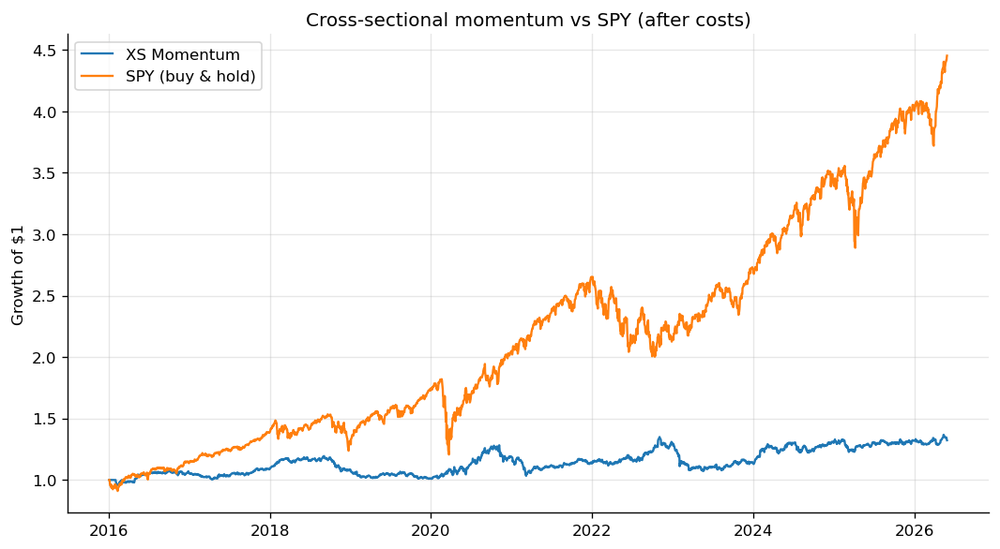

# quantlab — a systematic trading research toolkit

A from-scratch quantitative research codebase covering the full path from raw market data
to a backtested, risk-managed strategy: data engineering, alpha signals, an event-driven
backtester, options pricing, market microstructure, and risk. Built in Python on free,
reproducible US-market data so anyone can clone it and reproduce every figure.

I come from a physics background, so the bias throughout is towards **doing the statistics
honestly** — no inflated backtests, explicit transaction costs, walk-forward validation
with leakage guards, and results reported as they actually came out (including the ones that
didn't beat buy-and-hold). A strategy you can trust to be flat is worth more than one you
can't trust to be brilliant.

<p align="center">
  <br>
  <em>Cross-sectional momentum vs SPY after realistic costs — an honest, un-inflated result.
  Every figure in this repo is generated from the data by <code>scripts/generate_report.py</code>.</em>
</p>

```
                    yfinance ─► SQL store (SQLite / Postgres)
                                      │
            ┌─────────────────────────┼─────────────────────────┐
         features                  models                   strategies
       (pandas/Polars)     (ARIMA·GARCH·ML·LSTM)      (stat-arb·momentum·ML)
            └─────────────────────────┼─────────────────────────┘
                                event-driven backtester
                          (portfolio · execution · cost model)
                                      │
              ┌───────────────┬───────┴────────┬────────────────┐
           options         micro-           risk /            execution
        (BS·Greeks·IV)   structure (LOB)   monitor (VaR·ES)   (FIX 4.2)
```

## Quickstart

```bash
# 1. Install (editable, with the deep-learning and dev extras)
pip install -e ".[deep,dev]"

# 2. Pull the data into the local SQL store (~45k rows, no API key needed)
python -m quantlab.data.ingest

# 3. Run the whole research pipeline and generate the report + figures
python scripts/generate_report.py

# 4. Run the test suite
pytest
```

The generated [research report](reports/research_report.md) is the best one-page tour of
what the toolkit produces — every number and figure in it is computed at run time.

## Research notebooks

The notebooks are the narrative front door — each is a self-contained piece of research with
the plots and tables rendered inline (open them directly on GitHub):

- **[01 · Statistical arbitrage](notebooks/01_statistical_arbitrage.ipynb)** — cointegration testing, spread diagnostics, *rolling* cointegration stability, a backtest, and a parameter-sensitivity sweep.
- **[02 · ML alpha signal](notebooks/02_ml_alpha_signal.ipynb)** — feature analysis, walk-forward IC, and the decile/quintile portfolio test that shows whether the signal actually *sorts* returns out-of-sample.
- **[03 · Options & risk](notebooks/03_options_and_risk.ipynb)** — Greeks across moneyness, a live SPY implied-vol smile, GARCH, and VaR/ES with the Gaussian-vs-fat-tail gap made visible.
- **[04 · Kalman & RL execution](notebooks/04_kalman_and_rl_execution.ipynb)** — a Kalman-filtered time-varying hedge ratio, and a reinforcement-learning agent that learns to front-load order execution as timing risk rises.

## How it maps to a quant-research brief

The repo was structured to demonstrate, with working code, each capability a systematic
quant role asks for:

| Requirement | Where it lives | What it does |
|---|---|---|
| Statistical & time-series modelling | [`models/timeseries.py`](quantlab/models/timeseries.py) | ADF stationarity, Engle-Granger cointegration, OU half-life, GARCH(1,1) |
| ML alpha signals | [`models/ml.py`](quantlab/models/ml.py) | Cross-sectional return-ranking model, scored by walk-forward IC |
| Deep learning | [`models/deep.py`](quantlab/models/deep.py) | A PyTorch LSTM forecasting realised volatility, with early stopping |
| Backtesting & simulation | [`backtest/`](quantlab/backtest) | Event-driven engine (Market→Signal→Order→Fill) with an explicit cost model |
| Model validation | [`models/validation.py`](quantlab/models/validation.py) | Purged/embargoed walk-forward CV; information-coefficient scoring |
| Market microstructure & order book | [`microstructure/order_book.py`](quantlab/microstructure/order_book.py) | A price-time-priority limit order book / matching engine |
| Execution quality | [`microstructure/execution_algos.py`](quantlab/microstructure/execution_algos.py) | TWAP/VWAP scheduling, implementation-shortfall analysis |
| Options & derivatives | [`options/`](quantlab/options) | Black-Scholes-Merton pricing, analytic Greeks, implied-vol solver & surface |
| Real-time risk / PnL monitoring | [`risk/monitor.py`](quantlab/risk/monitor.py) | Streaming PnL + limit-breach engine (leverage, concentration, drawdown) |
| Risk modelling (VaR) | [`risk/metrics.py`](quantlab/risk/metrics.py) | Historical / parametric / Monte-Carlo VaR + Expected Shortfall |
| Statistical arbitrage | [`strategies/stat_arb.py`](quantlab/strategies/stat_arb.py) | Cointegration pairs trade — rolling-beta **and** Kalman-filtered ([`models/kalman.py`](quantlab/models/kalman.py)) |
| Reinforcement learning | [`rl/`](quantlab/rl) | Q-learning agent for optimal execution (Almgren-Chriss MDP) |
| Macro / alternative-data forecasting | [`models/macro_forecast.py`](quantlab/models/macro_forecast.py) | Forecasts from VIX, yields, credit & FX proxies |
| FIX / electronic trading | [`execution/fix.py`](quantlab/execution/fix.py) | A FIX 4.2 NewOrderSingle encoder/decoder with checksum validation |
| SQL / PostgreSQL | [`data/database.py`](quantlab/data/database.py) | SQLAlchemy layer, SQLite by default, Postgres via one config flag |
| NumPy / pandas / Polars | throughout; [`features/`](quantlab/features) | Feature panel built in both pandas and Polars |

### On the Turkish-market specifics

The role references **BISTECH**, **VİOP**, **SPK** regulations and **FIX/BIST** connectivity.
Since this is a public, reproducible project I've built the *transferable* version of each on
US-market equivalents — the engineering and the maths are identical:

- **VİOP / options** → US listed options (same Black-Scholes machinery).
- **BISTECH matching** → a generic price-time-priority order book ([`order_book.py`](quantlab/microstructure/order_book.py)).
- **SPK algo-trading controls** → the pre-trade/intraday limit engine in [`risk/monitor.py`](quantlab/risk/monitor.py), conceptually the same as the SEC's Market Access Rule (15c3-5).
- **FIX/BIST connectivity** → a working FIX 4.2 message codec.

## A note on the results (deliberately honest)

Run the report and you'll see, for example, that cross-sectional momentum earns only a
modest Sharpe and *underperforms* SPY after realistic costs, and that most of the candidate
pairs are **not** cointegrated over the full sample. That's the point. The value of this
project is a pipeline that won't lie to you — the costs are real, the validation is
walk-forward, and there's no lookahead (there's a [test](tests/test_backtest.py) that
asserts it). Honest negative results are a feature.

## Tech stack

Python 3.10+ · NumPy · pandas · Polars · SciPy · scikit-learn · statsmodels · `arch`
(GARCH) · PyTorch · SQLAlchemy · matplotlib · pytest.

## Repository layout

```
quantlab/            the installable package (see the table above)
scripts/             runnable entry points (ingestion, report generation)
tests/               pytest suite — correctness properties, not just smoke tests
reports/             the generated research report and figures
config/config.yaml   every tunable knob in one place
docker-compose.yml   optional PostgreSQL backend
```

## Optional: PostgreSQL backend

```bash
docker compose up -d                       # start Postgres
# set database.backend: postgres in config/config.yaml, then
pip install -e ".[postgres]"
python -m quantlab.data.ingest             # same pipeline, now against Postgres
```

---

*Data via [yfinance](https://github.com/ranaroussi/yfinance). For research/education; not
investment advice. MIT licensed.*
