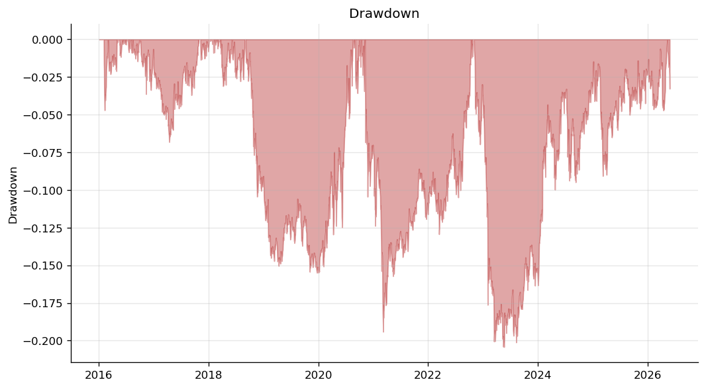
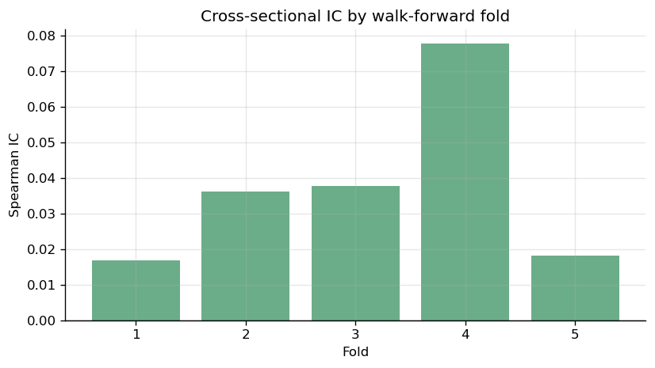
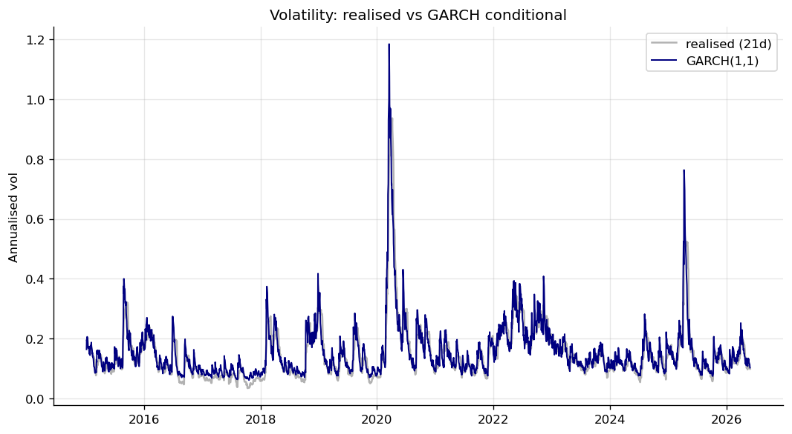
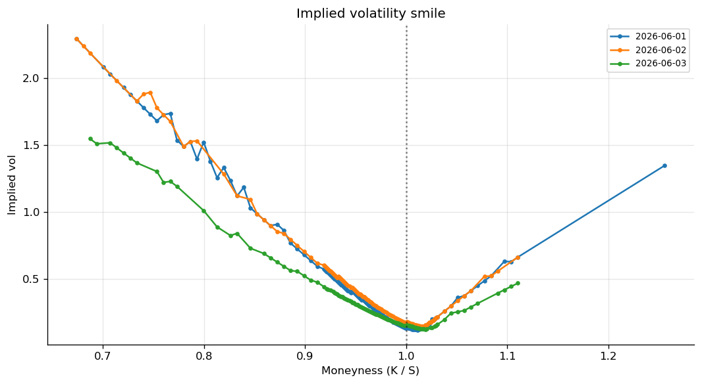

# Research Report

*Auto-generated by `scripts/generate_report.py` over 2015-01-02 → 2026-05-29, 16 symbols. Every figure and number below is computed from the data at run time.*

---

### Strategy backtests

Two strategies were run through the same event-driven engine with an identical cost model (1 bp commission + 2 bp half-spread + square-root market impact).

**Cross-sectional momentum** (12-1 month, dollar-neutral, monthly rebalance):

```
Performance summary
--------------------------------
  Total return   32.3%
  CAGR           2.73%
  Ann. vol       9.21%
  Sharpe         0.34
  Sortino        0.44
  Max drawdown   -20.4%
  Calmar         0.13
  # trades       655
  Total costs    $48,567
  Info ratio     -0.68
```

**Pairs stat-arb KO/PG** (rolling-beta spread, z-score entry/exit):

```
Performance summary
--------------------------------
  Total return   -0.4%
  CAGR           -0.04%
  Ann. vol       1.07%
  Sharpe         -0.03
  Sortino        -0.03
  Max drawdown   -3.6%
  Calmar         -0.01
  # trades       521
  Total costs    $46,504
```




*Read honestly: after realistic costs the naive momentum factor delivers a modest Sharpe and does not beat buy-and-hold SPY over this sample — exactly the kind of result that should make you trust the backtester rather than distrust it.*

### Cointegration analysis (Engle-Granger)

Each candidate pair is regressed leg-on-leg and the residual spread is ADF-tested. Only a stationary spread (p < 0.05) justifies a mean-reversion trade.

| Pair | Hedge β | ADF p-value | Cointegrated? | Half-life (d) |
|------|--------:|------------:|:-------------:|--------------:|
| KO/PG | 0.345 | 0.441 | no | 652 |
| JPM/BAC | 6.078 | 0.132 | no | 279 |
| XOM/CVX | 0.742 | 0.038 | yes | 261 |
| GOOGL/META | 0.346 | 0.480 | no | ∞ |


### Machine-learning alpha signal

A gradient-boosted model predicts the **cross-sectional ranking** of forward 21-day returns from the technical feature panel. Evaluation is walk-forward with a purge gap equal to the label horizon, scored by information coefficient (rank correlation).

- Mean IC: **0.0373**  (IC information ratio across folds: 1.69)
- Per-fold IC: [0.017, 0.036, 0.038, 0.078, 0.018]
- Most important features: mom_252, mom_63, vol_21, mom_126, mom_21



*An IC around 0.03-0.05 that survives walk-forward is a believable equity signal; a much larger number on this data would point to a leak, not a discovery.*

### Volatility modelling (GARCH)

A GARCH(1,1) with Student-t innovations on SPY daily returns. Persistence (α+β) = **0.9938** — close to 1, the well-known signature of slowly-decaying volatility clustering. The current annualised conditional vol is **10.3%**.



### Tail risk (VaR / ES at 99%)

| Method | 1-day VaR | Note |
|--------|----------:|------|
| Historical | 3.23% | empirical, no distributional assumption |
| Parametric (Gaussian) | 2.54% | thin tails — *understates* risk |
| Monte Carlo (Student-t) | 3.08% | fat tails, fitted df |
| **Expected Shortfall** | **4.76%** | mean loss beyond VaR (coherent) |

*The Gaussian VaR sitting well below both the historical and Student-t numbers is the whole argument for not trusting a normal assumption in the tails.*

### Execution quality (TWAP vs VWAP)

A 50k-share parent order sliced across an intraday session with a U-shaped volume profile, scored by implementation shortfall vs the arrival price.

| Algo | Avg fill | Shortfall (bp) | vs VWAP (bp) |
|------|---------:|---------------:|-------------:|
| TWAP | 101.9601 | +195.6 | +204.0 |
| VWAP | 101.8923 | +188.8 | +197.2 |

*Tracking the volume curve (VWAP) spreads impact more evenly and beats naive TWAP on shortfall here.*

### Implied volatility surface (live SPY chain)

Every quote on the nearest expiries inverted to an implied vol via the Black-Scholes solver. The upward curvature away from the money is the volatility smile/skew — the market pricing in fatter tails than a flat-vol model.


